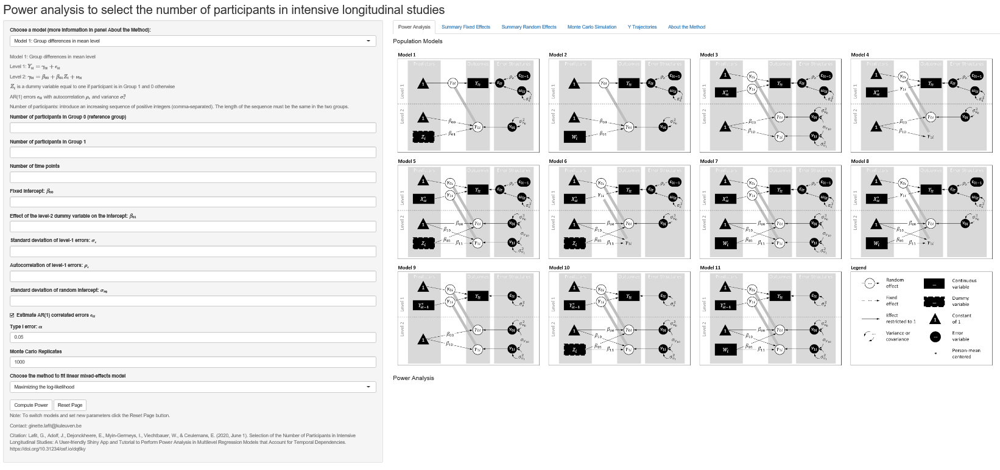
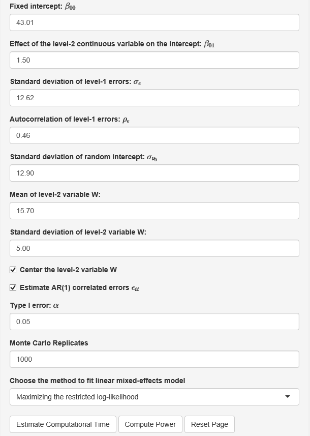

# PowerAnalysisIL

The repository contains functions used in the following [paper](https://psyarxiv.com/dq6ky/):

Lafit, G., Adolf, J., Dejonckheere, E., Myin-Germeys, I., Viechtbauer, W., & Ceulemans, E. (2020, June 1). Selection of the Number of Participants in Intensive Longitudinal Studies: A User-friendly Shiny App and Tutorial to Perform Power Analysis. 

## Shiny app and R package to perform power analysis to select the number of participants in intensive longitudinal studies

Users can download the app and run locally on their computer by executing the following commands in R or Rstudio. 

```
# Check if R packages are installed

list.of.packages = c("htmltools","shiny","htmltools","shiny","DT","nlme","ggplot2","gridExtra",
"data.table","plyr","dplyr","formattable","tidyr","MASS","shinyjs","compiler","future.apply","devtools")
new.packages = list.of.packages[!(list.of.packages %in% installed.packages()[,"Package"])]
if(length(new.packages)) install.packages(new.packages)

library(htmltools)
library(shiny)
library(DT)
library(nlme)
library(ggplot2)
library(gridExtra)
library(data.table)
library(plyr)
library(dplyr)
library(formattable)
library(tidyr)
library(MASS)
library(shinyjs)
library(compiler)
library(future.apply)

library(devtools)
devtools::install_github("ginettelafit/PowerAnalysisIL", force = T)

library(PowerAnalysisIL)

# Using Gist: users can launch this app with:
shiny::runGist('6bac9d35c2521cc4fd91ce4b82490236')

```

## Screenshot of the PowerAnalysisIL Shiny app 



## How the app works in a nutshell

The shiny app focuses on a set of research questions regarding intensive longitudinal data that can be estimated using specific multilevel regression models. These research questions include:

* Group differences in the mean level of the outcome of interest
* Effect of a level-2 continuous predictor on the mean level of the outcome of interest
* Effect of a level-1 continuous predictor on the outcome of interest
* Group differences in the effect of a level-1 continuous predictor on the outcome of interest
* Cross-level interaction effect between the continuous level-2 predictor and a continuous level-1 predictor
* Multilevel autoregressive models: mean autoregressive effect
* Multilevel autoregressive models: group differences in the mean autoregressive effect
* Multilevel autoregressive models: cross-level interaction effect between a continuous level-2 predictor and the lagged outcome of interest 

To illustrate how the app works we will consider a researcher who is planning an Intensive Longitudinal (IL) study to test the hypothesis that depression (level-2 continuous variable) is positively related to negative affect (Affect).


where the level-1 and level-2 errors are mutually independent 

AR(1) level-1 errors  with autocorrelation  and variance 

the level-2 errors are normally distributed: 

The data will be collected using an IL design, including 70 measurement occasions per individual. How many participants does she need to involve? 

### Step 1: App Input

To perform simulation-based power analysis, we need to specify the parameter values of Model of interest. We select Model 2 (i.e., effect of a level-2 continuous predictor on the mean level of the outcome variable). We indicate that we want to consider the following sample sizes: 15, 30, 45, 60, 80, 100. We set the number of measurement occasions to 70.


Next, we fill in likely values of the model parameters. We start with the fixed effects: the fixed intercept is set to 43.01, and the effect of the level-2 continuous variable is set to 1.50.  Next, we set the standard deviation and autocorrelation of the within-individual errors, given by 12.62 and 0.46, respectively. The standard deviation of the random intercept is set to 12.90. For the variable depression, we fix the value of the mean to 15.70  and the standard deviation to 5.00. We select the options *Center the level-2 variable W* and *Estimated AR(1) correlated errors*. We set the Type I error to 0.05, and the number of Monte Carlo replicates to 1000. To estimate the multilevel model, we choose the option *Restricted Maximum Likelihood*. Finally, we click on *Compute Power*.



### Step 2: Visualize the power curve and inspect app output.

The app provides the power curves as a function of the sample sizes indicated above. The next Figure shows the estimated power curve to test the effect of depression on negative affect. 


The app also provides information about the distribution of the estimates of the fixed and random effects across the Monte Carlo replicates. The following figure shows the summary statistics for the fixed effects. 


The app also provides summary statistics of the estimated parameters of the standard deviation and autocorrelation of the level-1 errors, and the estimated parameters of the distribution random effects. 


As well as the distribution of the estimate parameters across the Monte Carlo replicates when the number of participants is 100.


